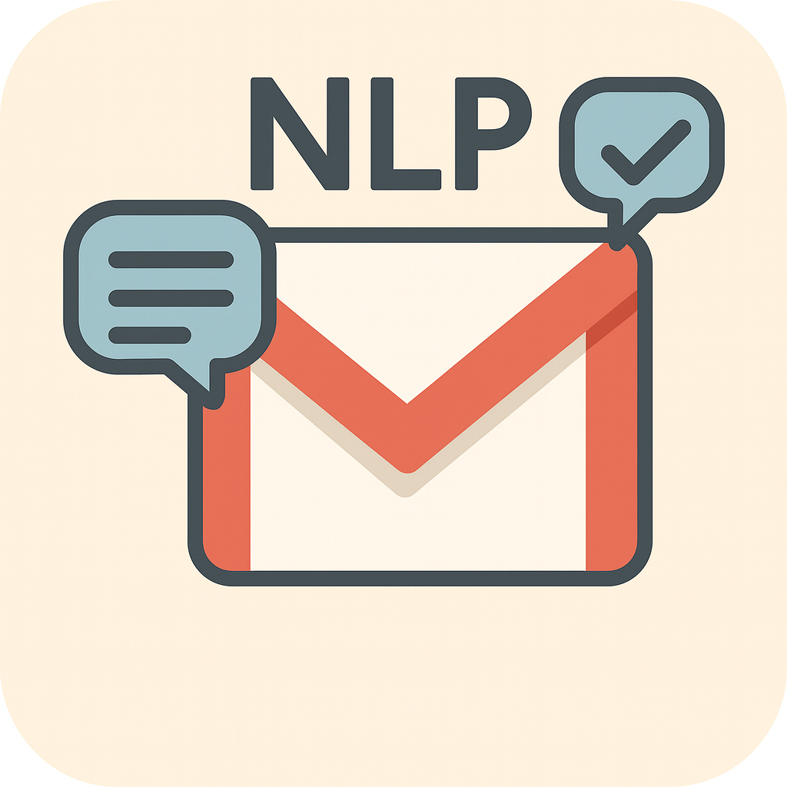

<h1 align="center">
   MailScribe
</h1>
MailScribe is an intelligent NLP-powered Gmail email summarizer and auto-responder.
It connects to Gmail, extracts messages, generates summaries (extractive or transformer-based), and optionally sends automated, context-aware replies.
Includes GUI, FastAPI backend, time-based targeting, and strong safety mechanisms.

---

# 📌 Overview  
This project implements an intelligent NLP-based Gmail Email Summarizer and Auto-Responder system. It can:

- Fetch emails from Gmail using OAuth.
- Extract plain-text from raw Gmail MIME messages.
- Summarize emails using extractive or transformer models.
- Auto-reply based on customizable rules.
- Reply to specific emails based on date/time.
- Label auto-replied messages.
- Provide safety checks to avoid loops, no-reply senders, OTP mails, promotions, etc.

---

# 🚀 Features

## ✔ Email Summarization  
- Extractive summarization (NLTK).  
- Abstractive summarization (HuggingFace Transformers).  
- HTML → Text cleaning.

## ✔ Auto-Reply System  
- Context-aware reply generation using summaries.  
- Skips automated, OTP, “no-reply”, promotional mails.  
- Prevents duplicate replies in same thread.

## ✔ Time-Based Replying  
- Reply using human datetime (e.g., `"2025-11-28 16:15"`).  
- Reply using Gmail internalDate timestamp.  
- Supports tolerance windows.

## ✔ Selective Targeting  
- Unread emails.  
- Newest emails.  
- Emails in specific date ranges.

## ✔ Extensible Utilities  
- Gmail API helpers  
- Reply templates  
- Safety guards  

## ✔ Additional Features  
- Tkinter GUI  
- FastAPI backend support  
- Future-ready automation stack  

---

# 📁 Project Structure  
*(Combined from both sections — all content preserved)*  

```
project/
│
├── __pycache__                    # Ignored
├── .gitignore
├── api_app.py                     # FastAPI backend file
├── auto_responder.py              # Reply logic + safety filters + labels
├── credentials.json               # OAuth (DO NOT COMMIT)
├── gmail_utils.py                 # Authentication, fetching, parsing
├── gui_app.py                     # GUI interface (if implemented)
├── reply_by_datetime.py           # Reply using human datetime
├── reply_by_human_datetime.py     # Advanced human time matcher
├── reply_by_internal.py           # Reply using Gmail internalDate (ms)
├── requirements.txt               # Required packages
├── run_me.bat
├── summarizer.py                  # CLI tool (summaries + auto-replies)
├── summarizers.py                 # NLP summarizers (extractive + transformer)
├── token.json                     # Auto-created OAuth token (DO NOT COMMIT)
├── README.md                      # Project documentation
└── LICENSE
```

---

# 🔐 Gmail API Setup (Required Once)

1. Go to Google Cloud Console  
   https://console.cloud.google.com

2. Create a project → Enable **Gmail API**

3. Create OAuth Client ID  
   - Type: **Desktop App**

4. Download → `credentials.json`  
   *(Place it in the project root — DO NOT upload it to GitHub)*

5. First run will open Google login → generates `token.json`

---

# 🖥️ Installation (Windows CMD / PowerShell)

### Step 1 — Create virtual environment  
```bash
python -m venv venv
```

### Step 2 — Activate  
**PowerShell**
```bash
venv\Scripts\Activate.ps1
```
**CMD**
```bash
venv\Scripts\activate
```

### Step 3 — Install dependencies  
```bash
pip install -r requirements.txt
```

### Optional (for GUI, API, PDF)  
```bash
pip install fastapi uvicorn reportlab python-multipart
```

---

# 📨 Usage

## ✔ Summarize unread emails  
```bash
python summarizer.py --query "is:unread" --mode extractive
```

## ✔ Auto-reply (safe DRY-RUN — recommended first)  
```bash
python summarizer.py --query "is:unread" --auto-reply --dry-run
```

## ✔ Auto-reply (actual sending)  
```bash
python summarizer.py --query "is:unread" --auto-reply --no-dry-run
```

## ✔ Reply to a specific date/time  
```bash
python reply_by_human_datetime.py --datetime "2025-11-30 16:15" --tz "Asia/Kolkata" --no-dry-run
```

## ✔ Start GUI  
```bash
python gui_app.py
```

## ✔ Run API backend  
```bash
uvicorn api_app:app --reload
```
FastAPI docs → http://127.0.0.1:8000/docs

---

# 🛡 Safety Rules  
The system automatically skips:

- OTP emails  
- Promotions  
- Automated “do not reply” messages  
- Mails already replied in the thread  
- System notifications  

---

# ✔ Recommended GitHub Setup

## `.gitignore`
```
venv/
__pycache__/
credentials.json
token.json
.cache/
.huggingface/
```

## Git initialization  
```bash
git init
git add .
git commit -m "Initial commit"
```

## If credentials leaked accidentally  
```bash
git rm --cached credentials.json token.json
git commit -m "Remove sensitive OAuth files"
```

## Push to GitHub  
```bash
git branch -M main
git remote add origin https://github.com/<username>/<repo>.git
git push -u origin main
```

---

# 🛡 GitHub Workflow (Blocks secrets from being pushed)
Create file:  
`.github/workflows/block-secrets.yml`

```yaml
name: Block Secrets on Push

on: [push, pull_request]

jobs:
  scan:
    runs-on: ubuntu-latest
    steps:
      - name: Checkout Repo
        uses: actions/checkout@v3

      - name: Fail if credentials.json exists
        run: |
          if [ -f "credentials.json" ]; then
            echo "ERROR: credentials.json must NOT be committed."
            exit 1
          fi

      - name: Fail if token.json exists
        run: |
          if [ -f "token.json" ]; then
            echo "ERROR: token.json must NOT be committed."
            exit 1
          fi
```

---

# 🔮 Future Enhancements  
- Web dashboard (Streamlit/React)  
- Improved transformer summarization  
- ML classifier for human vs bot emails  
- GUI desktop app  
- Full FastAPI backend  

---

# 📄 License  
Academic use only.

